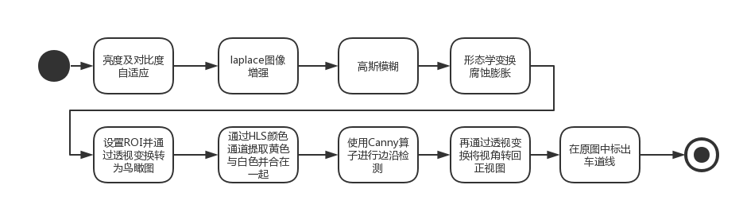
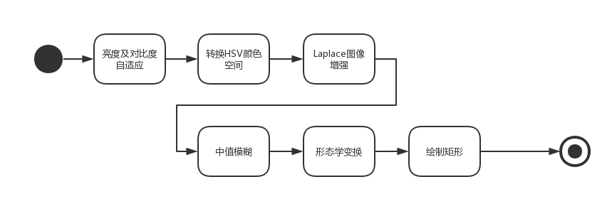
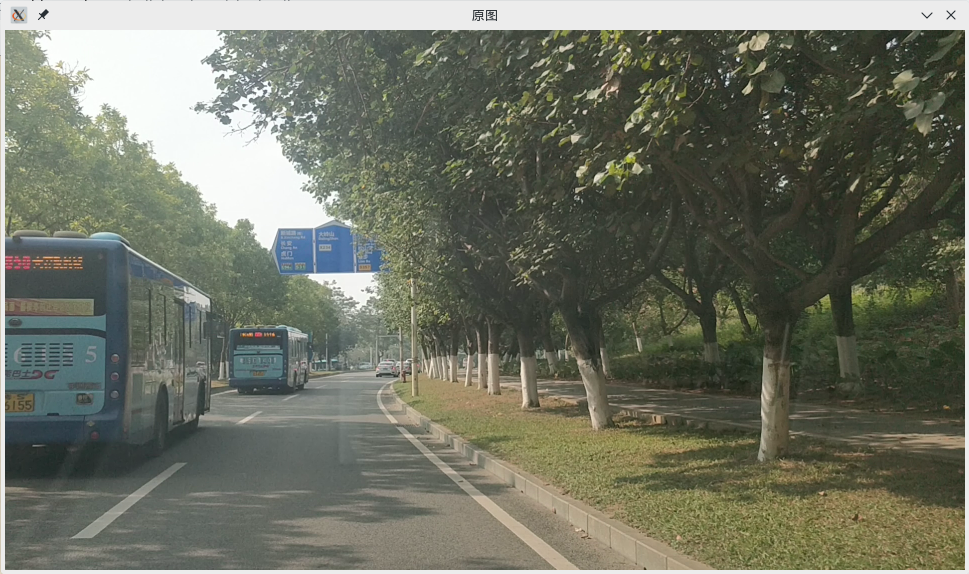
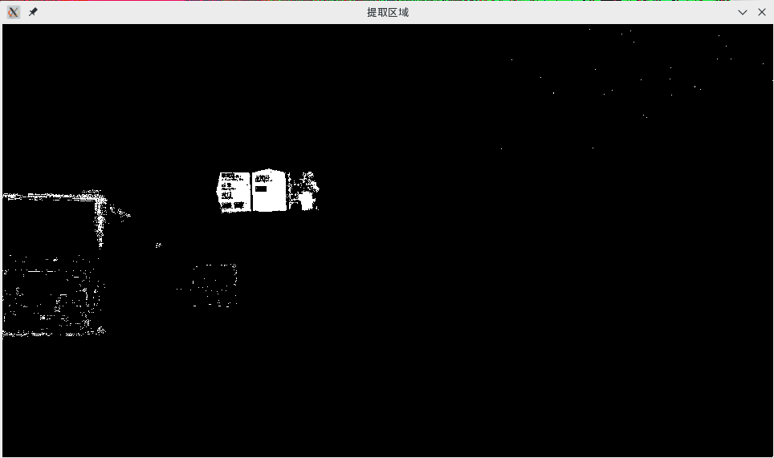
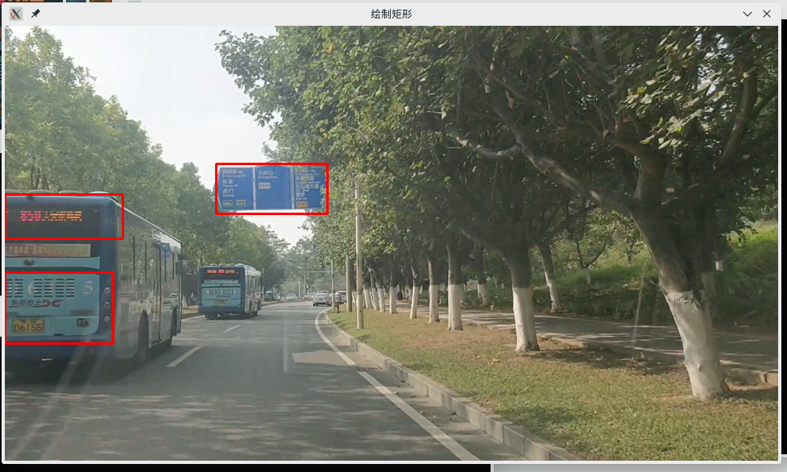

road\_detect
------------
道路识别

目录
----
-   [road\_detect](#road_detect)
-   [概述](#概述)
    -   [课程设计的目的](#课程设计的目的)
    -   [课程设计任务及要求](#课程设计任务及要求)
    -   [开发该系统软件环境及使用的技术说明](#开发该系统软件环境及使用的技术说明)
-   [系统设计的基本概念与原理](#系统设计的基本概念与原理)
    -   [系统基本工作流程](#系统基本工作流程)
    -   [车道线检测算法设计](#车道线检测算法设计)
    -   [道路标示牌检测算法设计](#道路标示牌检测算法设计)
    -   [用户接口设计](#用户接口设计)
-   [系统实施详细说明及结果](#系统实施详细说明及结果)
    -   [道路检测算法的实现](#道路检测算法的实现)
    -   [道路标示牌检测算法实现](#道路标示牌检测算法实现)
    -   [系统运行结果及算法性能](#系统运行结果及算法性能)
    -   [课程设计总结](#课程设计总结)
-   [参考文献](#参考文献)

重要文档链接
-----------
- [《机器视觉》课程设计说明](docs)

概述
----

### 课程设计的目的

### 课程设计任务及要求

据调查，道路交通事故中有 1/3
是由车辆变道或车辆偏离其正常行驶车道区域所导致的。美国联邦公路局的研究表明：如果可以获得车辆与车道之间的相对位置信息，则可以防止
53%左右的车道偏离事故，因此针对路面标线检测的研究是实现车道偏离警告系统的关键技术，其对于实现车辆的完全自主驾驶具有深远的意义。在此背景下，本课程的课程设计任务为：

**利用OpenCV库和其他开源工具，实现车道线和道路标示牌的实时检测**

系统的基本功能要求如下：

1.  利用C/C++代码实现，用git进行版本管理，代码提交应该包含有开发日志（git提交日志）。

2.  测试和验证视频样本由老师提供，也可自行采集，自行采集的应该包括至少两类目标：明显的道路线和一定数量的道路标识牌。

3.  提供比较友好的用户接口，可以由用户自行加载不同的视频。应该包含合适的输出界面，将结果呈现给用户。

4.  检测流程应该包括"道路预处理车道线特征提取车道线检测"

5.  检测后的结果应该能实时输出，例如：检测到的车道线实时与视频显示在同一窗口。

6.  实时检测出视频中的道路标识，从视频中把道路标识分割出来，并显示在窗口中。

7.  界面实现可以参考下图，也可以按照自己的方式实现。

> {width="4.208333333333333in"
> height="3.0416666666666665in"}

### 开发该系统软件环境及使用的技术说明

开发环境：
- Linux 
- opencv 
- C++ 
- clion 
- qt creater

涉及到的技术：

- 亮度及对比度自适应算法
- Laplace图像增强算法
- 膨胀腐蚀算法
- 透视变换
- ROI图像分割技术
- 颜色空间转换
- Canny边缘检测
- Hough直线检测


系统设计的基本概念与原理
------------------------

> 应包含核心代码

### 系统基本工作流程

> 系统整个工作流程图及文字描述

### 车道线检测算法设计

> 算法流程图，文字描述



1. 对原视频进行亮度及对比度自适应， 使视频更清晰。

2. 使用Laplace对原视频质量增强。

3. 对视频进行一些预处理，如腐蚀膨胀，平滑处理等，设置ROI，减少画面中车道线以外的干扰物的影响。

4. 对原视频进行反透视变换，将视角转变为鸟瞰图。

5. 通过HSL颜色通道提取黄色与白色并合并在一起。

3. 进行Canny变换，检测出画面的边缘并且对图像自动进行二值化处理。

4. 所得图像进行Hough变换，通过阀值，线段最短长度，连接为线段的最长间隔的设定来检测出画面中存在的直线。

5. 直线筛选，计算第四步所得线段的斜率，从中挑选符合要求的线段，并用cvLine函数标示到画面中。

6. 将所得画面再次进行透视变换，变回原视角。


### 道路标示牌检测算法设计



1. 对原视频进行亮度及对比度自适应， 使视频更清晰。

2. 转换为HSV颜色空间。

2. 使用Laplace对原视频质量增强。

3. 中值模糊

4. 形态学变换

3. 绘制矩形。


### 用户接口设计

> 接口设计思路，文字描述


系统实施详细说明及结果
----------------------

### 道路检测算法的实现

> 关键代码及文字说明

```CPP

    Mat auto_frame, adjust_frame, denoise_frame;
    Mat enhancement_frame, morphological_frame;
    Mat warp, edges_frame;
    Mat mask_frame, output;

    // 设置ROI
    Mat roi_mat;
    vector<Vec4i> lines;

    //亮度及对比度自适应
    int brightness = 255;
    int contrast = 255;
    BrightnessAndContrastAuto(input, auto_frame, 5);
    adjustBrightnessContrast(auto_frame, adjust_frame, brightness - 255, contrast - 255);
    if(flag) imshow("亮度及对比度自适应结果", adjust_frame);

    //图像增强
    enhancement_frame = imgEnhancement(adjust_frame);
    if(flag) imshow("使用Laplace图像增强的道路图", enhancement_frame);

    //进行模糊化处理
    denoise_frame = deNoise(enhancement_frame);
    if(flag) imshow("经过模糊化处理的道路图", denoise_frame);

    //形态学变换
    morphological_frame = imgMorphological(denoise_frame);
    if(flag) imshow("经过形态学变换的道路图", morphological_frame);

    //透视变换
    warp = getWarpPerspective(morphological_frame);
    if(flag) imshow("经过透视变换的道路图", warp);

    //标记黄色与白色
    mask_frame = imgMask(warp);
    if(flag) imshow("标记黄色与白色", mask_frame);

    //边缘检测
    edges_frame = edgeDetector(mask_frame);
    if(flag) imshow("进行边缘检测", edges_frame);

    // roi Hough直线检测
    HoughLinesP(mask_frame, lines, 1, CV_PI / 180, 30, 30);
    Mat copy_mask = Mat::zeros(warp.size(), warp.type());
    for (auto &i : lines) {
        line(copy_mask, Point(i[0], i[1]), Point(i[2], i[3]), Scalar(255,255,0),2);
    }

    input.copyTo(output);
    Mat re_warp = reverse(copy_mask);
    for (int i = 0; i < output.rows; ++i) {
        for (int j = 0; j < output.cols ; ++j) {
            if (!(!re_warp.at<Vec3b>(i,j)[0] && !re_warp.at<Vec3b>(i,j)[1] &&!re_warp.at<Vec3b>(i,j)[2] )) {
                output.at<Vec3b>(i,j)[0] = 0;
                output.at<Vec3b>(i,j)[1] = 0;
                output.at<Vec3b>(i,j)[2] = 255;
            }
        }
    }
    if(flag) imshow("标出车道线的原图", output);
    if(flag) imshow("copy_mask", re_warp);

```

### 道路标示牌检测算法实现

> 关键代码及文字说明
```cpp
    Mat output, auto_frame, adjust_frame;
    input.copyTo(output);

    Mat temp = Mat::zeros(input.size(), CV_8UC1);

    //亮度及对比度自适应
    int brightness = 255;
    int contrast = 255;
    BrightnessAndContrastAuto(input, auto_frame, 5);
    adjustBrightnessContrast(auto_frame, adjust_frame, brightness - 255, contrast - 255);
    if(flag) imshow("亮度及对比度自适应结果", adjust_frame);

//  Mat roi = getRoi(resize_frame);
    // 转换HSV颜色空间
    Mat HSV_frame;
    cvtColor(adjust_frame, HSV_frame, COLOR_BGR2HSV);
    if(flag) imshow("转换HSV颜色空间", HSV_frame);

    // 图像增强
    Mat enhance_mat = imgEnhancement2(HSV_frame);
    if(flag) imshow("图像增强", enhance_mat);

    // 提取区域
    Mat filter_mat = filterMat(enhance_mat);
    if(flag) imshow("提取区域", filter_mat);

    // 模糊处理
    Mat blur_mat = blurMat(filter_mat, 3);
    if(flag) imshow("模糊处理", blur_mat);

    // 形态学变换
    Mat morph_mat = imgMorphological(blur_mat);
    if(flag) imshow("形态学变换", morph_mat);

    // canny边缘处理
//        Mat canny_mat = cannyMat(morph_mat);

    //绘制矩形
    Mat result = drawRect(morph_mat, output);
    if(flag) imshow("绘制矩形", result);
    if(flag) imshow("morph_mat", morph_mat);

```

### 系统运行结果及算法性能

> 给出算法处理的效率（每次处理所需要的时间）和算法的准确率的统计。

道路检测运行结果


道路标示牌检测运行结果









### 课程设计总结

> 简要描述设计过程中遇到的问题，解决的方式

参考文献
--------
- OpenCV官方参考文档  
- Github网站  
- https://github.com/tatsuyah/Lane-Lines-Detection-Python-OpenCV  
- https://github.com/naokishibuya/car-finding-lane-lines  
- https://github.com/georgesung/advanced_lane_detection  
- https://github.com/DavidAwad/Lane-Detection  
- http://www.transistor.io/revisiting-lane-detection-using-opencv.html  
- [基于opencv的车道线实施检测（浙江大学）](https://wenku.baidu.com/view/a93bb15384254b35eefd34bd.html)
- https://www.bilibili.com/video/av23653073/
- [Lane-Detection-for-Autonomous-Cars](https://github.com/MichiMaestre/Lane-Detection-for-Autonomous-Cars)
- [亮度对比度调整](https://formoon.github.io/2018/01/04/opencv-brightness-and-contrast/)
- [从简单车道线识别认识调参的重要性](https://zhuanlan.zhihu.com/p/29012549)
- [Opencv图像增强算法实法](https://loopvoid.github.io/2017/02/19/Opencv%E5%9B%BE%E5%83%8F%E5%A2%9E%E5%BC%BA%E7%AE%97%E6%B3%95%E5%AE%9E%E6%B3%95/)
- https://github.com/TomLao/LaneLine-and-Sign-Detection